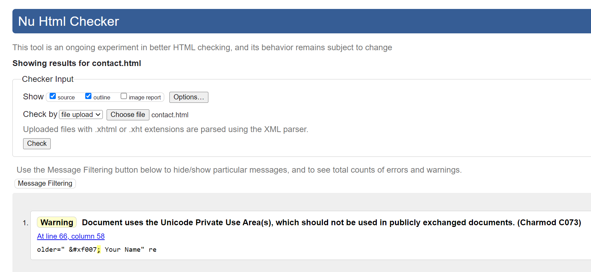

# Purpose of the project
Freelance digital journalist and writer Mathew Aleen introduces his online portfolio with a professional photograph of himself and links to different sections of his website. Based in London, Allen has also lived and worked in San Francisco. The portfolio features his best and most recent work experience, as well as some of the agencies he has written for. 

    

## Site Owner's goals
-   Help clients understand more about Mathew's career and his areas of focus as a journalist.
-   Help Mathew effectively present his skills and experience to news agencies.
-   Help recruiters and people who are interested in Mathew's work to reach easily.
  
## External User's goals
Whether I am a visiting user or an interested recruiter, I want to:
- Easily find out about Who is Mathew Allen and What does he do.
- Navigate smoothly to Mathew's previous experiences in journalism and his main skills.
- See what other friends or co-workers may would say about Mathew's professional work.
- Be able to Contact Mathew for further questions or any enquiries.

--------

# UX Design

## Wireframes

 - **Desktop Wireframe using Miro:**
    

 - **Tablet Wireframe using Miro:**
    

 - **Mobile Wireframe using Miro:**
    

## Features

 - **Header**
 
    The header at the top of each page contains Mathew's personal logo for his website and a navigation bar links to his home page, his Experience page and his contact page. The navigation bar can extend or collapse, depending on the screen size.
    
    

- **Footer**
  
    The footer at the bottom of all the pages contains four icons of the social media links for _Mathew_ and it will open in a new tap when clicked.
   
    

- **Home Page**

    - It has a big hero photo of Mathew with his name and his title job. Addtionly, a button that takes the user directly to make cantact with Mathew
       
    

    - It also has a brief introduction about Mathew's professionals
    
    

    - Testimonial feature that has a sample of people who new Mathew or worked with to give their expressions and opinions about him. 
    
    

- **Experience Page**

    It contains both Mathew's Experience roles in two different companies and a summary of his skills as a digital journalist.

    

- **Contact Page**

    It has a form of input fields [name, phone number, email address and a message text area] for a user who would like to contact Mathew. The fields in the form are required to be filled so the user can send his message.
    
    

- **Thank You Page**

    Once the form has been sent, the user is redirected to this thank you page confirming that the message was sent and the user will be contacted soon by Mathew.

    

## Future Features
- Additional page for his articles.
- link his send message ??? 

# Typography and color scheme

## Colour Scheme
The two main colours used are black(background) and white (text) or vice versa. Also, the lime green color is added throughout the website whether for the span or as background hover links ,also for buttons and the fontawesome icon in the Thank you page to give more liveliness to the site.

## Typography
The Roboto font was used in the portfolio for the headings and the buttons. The Oswald was used for the sections' titles, except for the name in the home page the font was Cardo. The Exo font was used for the paragraphs and with Sans Serif as the fallback font in case for any reason the fonts aren't being imported into the site correctly.
 
# Technology
 - ## Languages Used
    + HTML5
    + CSS3

 - ## Frameworks, Libraries & Programs Used
    - **Bootstrap 5.2.3:**
    Bootstrap was used to assist with the responsiveness and styling of the website.

    - **Google Fonts:**
    Google fonts were linked into the html files throughout the project.

    - **Font Awesome 6.2.1:**
    Font Awesome was used on all pages throughout the website to add icons for aesthetic and UX purposes.

    - **GitHub:**
    GitHub is used to store the projects code after being pushed from Git.

    - **Print 3D:**
    Paint 3D was used to resizing images and editing photos for the website.

    - **Canvas**
    canvas was used to create the logo.

    - **Miro:**
    Miro was used to create the wireframes during the design process.

# Testing

## Code Validation
- **HTML**
    1. The index file was validated by [HTML Validator](https://validator.w3.org/) and no errors or warning were found. 
    

    2. The experience file was validated by [HTML Validator](https://validator.w3.org/) and no errors or warning were found.
    

    3. The contact file was validated by [HTML Validator](https://validator.w3.org/) no errors were found but a warning about the Unicode Private Use Area I used when placing the fontawesome icon folowed by (;). After searching in [Stack Overflow: Answer by Mike Smith](https://stackoverflow.com/questions/23978976/fontawesome-usage-displeases-w3c-validator/31703251#31703251) and reading the articles https://www.w3.org/TR/charmod/#C073 and https://hsivonen.fi/charmod-checking/ , I undrestood the issues that these are documented/standardized linting rules but also, if I've checked the file in different browsers and it’s working fine, I can safely ignore this warning.
    

    4. The thank you file was validated by [HTML Validator](https://validator.w3.org/) and no errors or warning were found. 
    

- **CSS**

    The style sheet was validated by using [CSS validater](https://jigsaw.w3.org/css-validator/)
    
    

## Solved bugs

- ### Using Chrome Devtool
    - The Hero image ... 

    - For mobile device the texts in both the experience box and the skills box in the Experience page used to overlap. To fix the problem I changed the div height style from height to min-height.
    

    - The button under the hero image was floating to the left so I had to delete the __justify_content_center__ and then give it the approbrite margin top and bottom.
    

- ### Using Lighthouse
    When ckecking through lighthouse for desktop and mobile devices I got these results

    

    The accessibilty score was 89 and 78 so, to solve the issue for users who rely on screen readers I added _aria-label="button"_ to all button elements, _aria-label="Link to"_ to all link elements and for the text elements to have sufficient color contrast against the background I darkend the background for the buttons from  #159765 to #0f5b3e5f.

    

    

## Known bugs
No bugs were found.

# Further Testing  ???

# Deployment
- via VS code
- **via github pages:**

To deploy the page via github pges follow these steps:
1. On GitHub, navigate to the repository ....
2. Under your repository name click **Settings**.
3. In the "Code and automation" section of the sidebar, click  Pages.
4. Under "Build and deployment", under "Source", select Deploy from a branch.
5. Under "Build and deployment", under "Branch", use the None or Branch drop-down menu and select a publishing source.
6. The live link of the website will appeare on the Github Pages section.

    **The live link** https://jawahir01.github.io/personal_site/

# Credits

## Content
1. All the content is a resume sample.
 Source: https://www.bestsampleresume.com/sample-communication-resume/digital-journalist-resume.html

    __**Note:**__  I changed the name of the candidate to Mathew Allen.

2. The header code is edited using the nav and the navbar sections from https://www.w3schools.com/bootstrap5/

3. The Hero image code is edited using responsive images section from https://www.w3schools.com/bootstrap5/

4. The icons in the website were from [Font Awesome](https://fontawesome.com)

5. The idea of the span in the Hero text, bttuons and the contact form are from 
    https://bootstrapmade.com/photofolio-bootstrap-photography-website-template

6. The testimonial code is edited using the Quotes Slideshow section and the Testimonials section from https://www.w3schools.com/howto/howto_js_quotes_slideshow.asp 

7. In the Contact page, the code of the icons inside the palceholder is from [Stackoverflow](https://stackoverflow.com/questions/19350291/use-font-awesome-icon-in-placeholder). The member @huckbit _Mar 29, 2016 at 14:43_ shared his method in this [code](https://codepen.io/huckbit/pen/rezezb?editors=1100#0), then I used the rest of the FontAwesome hex-code icons from https://fontawesome.com/v4/cheatsheet/

## Media
1. I edited the design of the logo from [Canva](https://www.canva.com/logos)

2. The photograph used in the home page _Hero image_ is from https://www.dreamstime.com/

3. The photos in the testimonial section are _fake people_ from [google](http://www.google.com). I searched for _random face generator_.

## Acknowledgements
1. My supervisor at City of Bristol College _Pasquale Fasulo_.
2. My Mentor Guidance at Code Institute _Rohit Sharma_.
3. Tutors and community members at Code Institute.